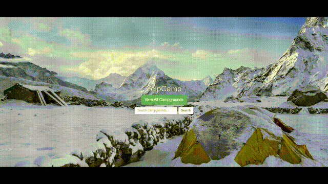

# Yelp Camp

### [Link](https://r-currie-park.herokuapp.com/) to live app

A full stack Yelp clone that focuses on reviewing campsites. 

### Technologies
* [Node.js](https://reactjs.org/) 16.11.0
* MongoDB
* ExpressJS
* [Mongoose](https://reacttraining.com/react-router/web/guides/quick-start) 5.1.2
* [Passport](https://fontawesome.com/) 5.12.0
* [Google Maps API](https://facebook.github.io/create-react-app/docs/getting-started)

### Installing

1. Clone the repo into a folder
> git clone https://github.com/R-Currie/park.git
2. Run npm install
> npm install
3. Start server
> npm start
4. Enjoy!
