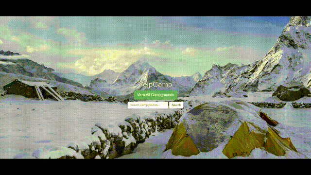

# Yelp Camp

### [Link](https://rcurrie-yelpcamp.herokuapp.com/) to live app

A full stack Yelp clone that focuses on reviewing campsites. 

### Technologies
* [Node.js](https://nodejs.org/en/docs/) 12.8.1
* [MongoDB](https://docs.mongodb.com/) 3.2.7
* [ExpressJS](https://expressjs.com/en/api.html) 4.17.1
* [Mongoose](https://mongoosejs.com/docs/api.html) 5.6.9
* [Passport](http://www.passportjs.org/docs/) 0.4.0
* [Google Maps API](https://developers.google.com/maps/documentation)

### Installing

1. Clone the repo into a folder
> git clone https://github.com/R-Currie/park.git
2. Install dependencies
> npm install
3. Set up MongoDB to your cluster
4. Start server
> node app.js
5. Enjoy!
